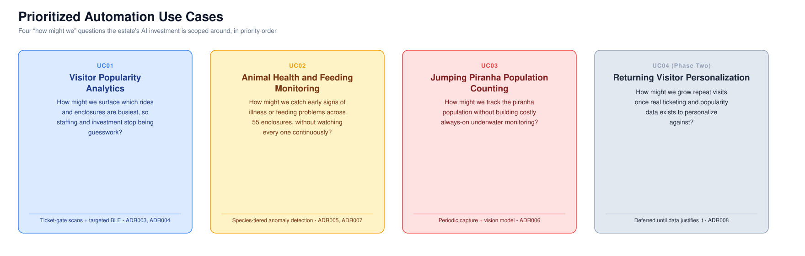
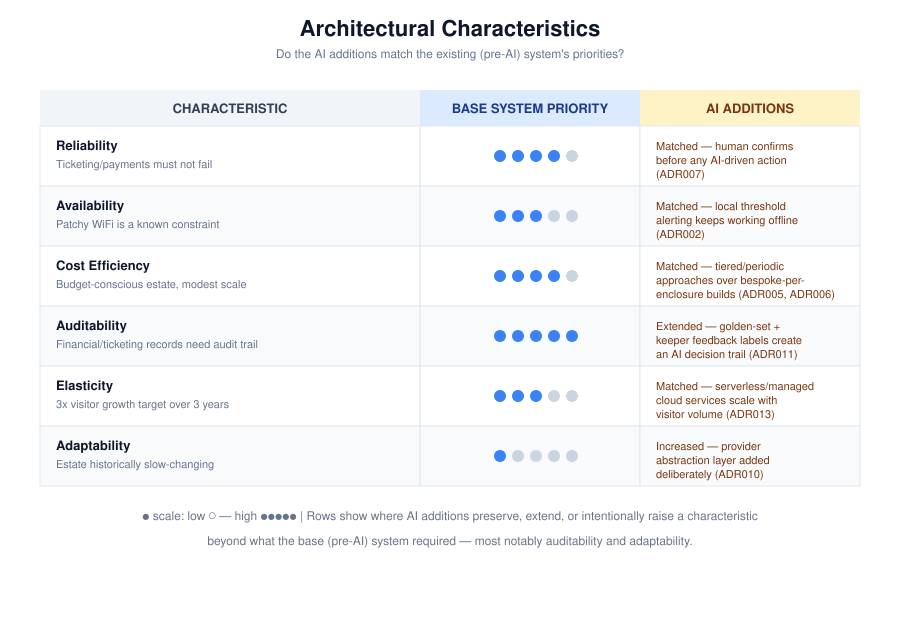

# Team Apex Warriors — Von Digitalis Estates | O'Reilly Architectural Katas (2026)

A structured approach to the **O'Reilly Architectural Katas 2026 — AI-Assisted Software Architecture** challenge.

## Table of Contents
- [Team](#team)
- [Glossary](#glossary)
- [Problem Definition](#problem-definition)
  - [Context](#context)
  - [Current State](#current-state)
  - [Challenges Behind the Growth Target](#challenges-behind-the-growth-target)
  - [Key Objective](#key-objective)
  - [Constraints](#constraints)
- [Solution](#solution)
  - [Business Outcomes Targeted](#business-outcomes-targeted)
  - [Automation Use Cases Using AI](#automation-use-cases-using-ai)
  - [Architecture Characteristics](#architecture-characteristics)
  - [Detailed Architecture Designs](#detailed-architecture-designs)
    - [UC01 — Visitor Popularity Analytics](#uc01--visitor-popularity-analytics)
    - [UC02 — Animal Health & Feeding Monitoring](#uc02--animal-health--feeding-monitoring)
    - [UC03 — Jumping Piranha Population Counting](#uc03--jumping-piranha-population-counting)
    - [UC04 — Returning Visitor Personalization (Future Phase)](#uc04--returning-visitor-personalization-future-phase)
  - [Testing Strategy](#testing-strategy)
  - [Limitations of the AI Adoption](#limitations-of-the-ai-adoption)
  - [Productionizing an AI/ML-Powered System](#productionizing-an-aiml-powered-system)
- [Final Thoughts](#final-thoughts)
  - [Anti-Patterns We Deliberately Avoided](#anti-patterns-we-deliberately-avoided)
  - [Roadmap](#roadmap)
  - [Our Learnings](#our-learnings)

## Team
**Team Apex Warriors**
<!-- Add team member names, roles, and links here, e.g.:
- [**Name**](https://linkedin.com/in/...), Role
-->

## Glossary
[Glossary](business-requirements/glossary.md) — ADR, LoRaWAN, MQTT, species-tiered monitoring, golden-set regression, and the other terms used throughout this repo.

# Problem Definition

## Context

The **72nd Countess Von Digitalis** has unexpectedly inherited a large, sprawling estate. The family's previous revenue source — explosive garden gnomes — is no longer viable, and the estate needs digital solutions to become profitable again.

The estate has three monetizable assets:
- A historically important collection of **40 eighteenth-century amusement park rides**, recently cleared to re-open after safety remediation.
- A previously private **exotic and poisonous animal collection** — 200+ animals across **55 displays/enclosures**, a mix of aquatic and land-based species (including a jumping piranha population) — now opening to the public.
- The estate grounds themselves as a visitor attraction.

## Current State

Current traffic is **~5,000 visitors/day**. There is no ticketing infrastructure, no visibility into which parts of the estate visitors actually gravitate toward, and no systematic way to monitor 200+ animals across 55 enclosures beyond keeper observation. WiFi coverage across the park is patchy, which shapes nearly every technical decision in this solution.

## Challenges Behind the Growth Target

The estate must grow to **at least 15,000 visitors/day within three years**, or the family will be forced to sell off other holdings. Three business problems stand in the way:

- **No visibility into popularity.** Staffing and investment decisions are guesswork without knowing which rides and enclosures actually draw visitors.
- **Animal care is a cost and reputation risk.** A sick or poorly-fed animal is expensive to treat and damaging to the estate's reputation if it goes unnoticed across 55 enclosures that keepers can't watch continuously.
- **Low visitor return rate.** Growing to 15,000/day is easier with repeat visits than with new visitors alone, and there's currently no mechanism encouraging anyone to come back.

## Key Objective

*"How might we use AI-assisted software architecture to give estate staff visibility into visitor popularity, keep 200+ animals healthy without constant manual watching, and grow both new and returning visitor numbers — on a budget-conscious, patchy-WiFi estate?"*

## Constraints

**Technical:**
- WiFi coverage across the park is patchy.
- Cloud services may be used, but the solution needs an explicit mechanism for getting data from the estate up to the cloud.
- Budget exists for MQTT-capable hardware devices, deployable throughout the park.

**Business/domain scale:**
- 40 rides in the amusement park area.
- 200+ animals across 55 displays/enclosures.
- ~5,000 visitors/day currently, targeting 15,000/day within 3 years.

**Evaluation criteria** this solution is judged against: innovative use of AI, suitability given the stated constraints, appropriate level of detail in diagrams, how well the solution handles uncertainty in AI technology, whether the AI additions' architectural characteristics match the existing architecture, and the validation/verification approach for AI-produced results.

Full brief: [Kata Brief](business-requirements/von-digitalis-kata.md) · [Judges & Resources](business-requirements/references/judges-and-resources.md)

# Solution

## Business Outcomes Targeted

Refer to the [detailed cost analysis](other_design_docs/cost-analysis.md) for the full breakdown of where money goes and where deliberate design choices avoided spending it.

- **Growth:** ~5,000 → 15,000 visitors/day within 3 years, driven by better-staffed/better-invested attractions (UC01), healthier and more reliably open animal exhibits (UC02/UC03), and a growing returning-visitor base (UC04).
- **Cost discipline:** every AI-related ADR chose the lower-cost, "good enough" option over the most sophisticated one available — see the [Cost-Avoidance table](other_design_docs/cost-analysis.md#cost-avoidance-decisions-where-design-choices-saved-money) for the full list of decisions and the spend each one avoided.
- **Risk reduction:** every AI output that could affect animal welfare or a business decision passes through mandatory human confirmation before anything happens (ADR007) — see [Architecture Characteristics](other_design_docs/architecture-characteristics.md).

## Automation Use Cases Using AI

We prioritized four use cases for this exercise, in the order the [Roadmap](#roadmap) rolls them out.

## Architecture Characteristics

Refer to the [detailed architectural characteristics analysis](other_design_docs/architecture-characteristics.md) for the full reasoning behind each priority and where the AI additions deliberately match, extend, or raise the bar set by the base (pre-AI) system.

In priority order: **Reliability** → **Availability under patchy connectivity** → **Cost Efficiency** → **Auditability** → **Elasticity** → **Adaptability**. Auditability and Adaptability are the two characteristics the AI additions *deliberately raise* above the base system's original bar — see [Where the AI Additions Deliberately Diverge](other_design_docs/architecture-characteristics.md#where-the-ai-additions-deliberately-diverge-and-why-thats-correct).

## Detailed Architecture Designs

The diagram below is the single reference for how the whole system fits together — estate/edge devices, the MQTT event bus, the cloud services layer, the AI/model layer, and data storage in one view. Each use case below zooms into one slice of it.

The same system in formal C4 notation — actors, external systems, containers, and the technology/protocol on every relationship:

### UC01 — Visitor Popularity Analytics
**How might we surface which rides and enclosures are busiest, so staffing and investment decisions stop being guesswork?**

Refer to [**UC01 detailed design**](usecases/uc01-visitor-popularity-analytics.md).

**Solution approach:**
- **Ticket-gate scans as the baseline signal, everywhere** ([**ADR003**](ADRs/adr003-popularity-tracking-method.md)) — reuses ticketing infrastructure (ADR009) so every one of the ~95 locations gets a popularity signal at no extra hardware cost.
- **Targeted BLE presence sensing** in a small number of high-value zones adds dwell-time data where it's worth the extra privacy surface, rather than deploying it estate-wide.
- **LoRaWAN sensor connectivity** ([**ADR001**](ADRs/adr001-mqtt-ingestion-architecture.md)) — chosen over WiFi/cellular after consulting the estate's IoT/hardware lead, routing ~95 sensors through 3 gateway concentrators instead of depending on patchy WiFi at every zone.
- **Hourly and daily batch aggregation** ([**ADR004**](ADRs/adr004-realtime-vs-batch-analytics.md)) — hourly for same-day staffing, daily for longer-term investment trend, with no dedicated streaming infrastructure.
- **Data minimization by default** ([**ADR018**](ADRs/adr018-visitor-data-privacy-governance.md)) — BLE identifiers are discarded immediately after aggregation into zone counts.

**Data flow:**

**Operations dashboard:**

### UC02 — Animal Health & Feeding Monitoring
**How might we catch early signs of illness or feeding problems across 55 enclosures, without watching every one continuously?**

Refer to [**UC02 detailed design**](usecases/uc02-animal-health-feeding-monitoring.md).

**Solution approach:**
- **Species-tiered monitoring profiles** ([**ADR005**](ADRs/adr005-animal-health-feeding-monitoring.md)) — mammal, reptile/land, and aquatic tiers share sensor kits and baseline models, with keeper-reported data as a first-class input, instead of a bespoke build per enclosure.
- **Two-speed edge/cloud inference** ([**ADR002**](ADRs/adr002-edge-vs-cloud-inference.md)) — simple local threshold alerting on the gateway works even while a zone is offline; the richer, cloud-side anomaly model runs once connectivity allows.
- **Tiered alert severity with mandatory human confirmation** ([**ADR007**](ADRs/adr007-alert-validation-false-positive-tolerance.md)) — a keeper always confirms or dismisses before any action is taken, and that label feeds back into model tuning.
- **Verification wrapped around every output** ([**ADR011**](ADRs/adr011-verification-nondeterministic-outputs.md)) — this is the solution's most AI-dependent use case, and the one with the most explicit guardrails.

**Data flow:**

**Guardrails:**

**Inside the service (C4, Level 3):** as the most AI-dependent container in the system, this is the one use case worth zooming past the container level — event routing, baseline lookup, inference, alert tiering, and the golden-set/drift feedback loop.

### UC03 — Jumping Piranha Population Counting
**How might we track the piranha population without building costly always-on underwater monitoring?**

Refer to [**UC03 detailed design**](usecases/uc03-piranha-population-counting.md).

**Solution approach:**
- **Periodic keeper-captured photo/video, assisted by a vision model** ([**ADR006**](ADRs/adr006-piranha-population-counting.md)) — instead of always-on underwater computer vision, which the brief's poor-visibility, occlusion, and maintenance realities make a poor investment for a single enclosure.
- Counts are compared against a running history; a meaningful decline routes through the **same tiered-alert/human-confirmation flow as UC02** (ADR007), rather than being auto-reported as fact.
- Low-confidence counts (poor water clarity, glare, occlusion) are explicitly flagged for manual keeper verification, not silently accepted.

**Data flow:**

### UC04 — Returning Visitor Personalization (Future Phase)
**How might we grow repeat visits once real ticketing and popularity data exists to personalize against?**

Refer to [**UC04 detailed design**](usecases/uc04-returning-visitor-personalization.md).

**Solution approach:**
- **Phase One (live at launch, no AI):** a simple loyalty mechanism ([**ADR008**](ADRs/adr008-returning-visitor-mechanism.md)) — discounted renewal or a digital loyalty card, applied automatically on return.
- **Phase Two (deferred, AI-assisted):** a recommendation model using UC01's popularity data and visitor history — explicitly held back until at least one full operating season of real data exists, so it isn't built against assumptions instead of evidence.
- Visitor identity for both phases runs through **OAuth/OIDC on the estate's own cloud platform** ([**ADR016**](ADRs/adr016-visitor-staff-authentication-access-control.md)) rather than being owned by the ticketing SaaS vendor, avoiding a second vendor lock-in on top of payments.

**Data flow (both phases):**

**Rollout gating:**

## Testing Strategy

Full detail: [Test Approach](usecases/test-approach.md) · per-use-case plans: [UC01](usecases/uc01-test-approach.md) · [UC02](usecases/uc02-test-approach.md) · [UC03](usecases/uc03-test-approach.md) · [UC04](usecases/uc04-test-approach.md)

The solution has two fundamentally different kinds of components, and they're tested differently rather than forced into one framework:

- **Deterministic components** — ticketing integration, ingestion, gateways, dashboards — behave the same way given the same input every time, and get a conventional test pyramid (unit → integration/contract → end-to-end → staff UAT).
- **Non-deterministic AI components** — anomaly detection, vision-based population counting, any future recommendation model — can produce different outputs for similar inputs, so "correct" is a statistical property, not a fixed assertion. These get golden-set regression as a **hard CI/CD gate** ([ADR011](ADRs/adr011-verification-nondeterministic-outputs.md), [ADR020](ADRs/adr020-cicd-model-deployment-pipeline.md)), shadow/canary evaluation for high-stakes changes, continuous production drift monitoring, and keeper feedback capture — layered on top of, not instead of, conventional testing.

Both tracks converge on the same shared observability stack ([ADR017](ADRs/adr017-observability-monitoring-infrastructure.md)), and both are subject to the same cross-cutting non-functional tests: load/performance scaled to the 15,000 visitors/day growth target (not just current volume), resilience against a simulated gateway backhaul outage, security tests for LoRaWAN keys/gateway certificates/RBAC boundaries ([ADR015](ADRs/adr015-iot-device-mqtt-security.md), [ADR016](ADRs/adr016-visitor-staff-authentication-access-control.md)), and disaster-recovery restore drills ([ADR019](ADRs/adr019-disaster-recovery-backup-strategy.md)).

Test ownership is explicit rather than assumed: engineering owns unit/integration/e2e/golden-set/non-functional tests; keeper/animal welfare staff own alert UAT and false-positive review ([ADR007](ADRs/adr007-alert-validation-false-positive-tolerance.md)); operations staff own popularity-accuracy spot-checks; security owns periodic penetration testing. Test investment is scaled to risk — animal-welfare-affecting and payment-affecting paths get the most rigorous testing, low-stakes dashboard cosmetics get the least.

## Limitations of the AI Adoption

- **Keeper review is a bottleneck by design.** Every consequential AI output (UC02 alerts, UC03 counts) requires human confirmation (ADR007) — this is deliberate for accuracy and trust, but it means the system's throughput on flagged issues is bounded by keeper availability, not model speed.
- **Vision-based population counting has real accuracy limits.** Water clarity, glare, and occlusion mean the piranha count is a decision aid, not ground truth (ADR006) — it must be validated against manual counts before being trusted unsupervised, and it will likely never be fully autonomous.
- **LoRaWAN coverage is a physical, not just architectural, risk.** The 3-gateway layout is a planning assumption pending a site RF survey (ADR001) — a real coverage gap could leave a zone's sensors unreachable until re-surveyed and adjusted.
- **Personalization (UC04 Phase Two) has a cold-start problem.** There is deliberately no AI recommendation feature until real ticketing/popularity data exists (ADR008) — building it earlier would mean personalizing against assumptions rather than evidence.
- **Model/provider drift is an ongoing risk, not a one-time solved problem.** Golden-set regression and drift monitoring (ADR011) catch degradation, but only for the failure modes the golden set and monitoring were designed to catch — an unanticipated failure mode could still slip through until surfaced by keeper feedback.

## Productionizing an AI/ML-Powered System

Building a scalable, reliable, and secure AI/ML-powered system requires carefully aligned components. Here's how we mapped this solution's real components onto the widely-used **"Emerging LLM App Stack"** reference architecture (a16z), even though this solution's AI features are closer to sensor-driven anomaly detection and vision counting than a chat-style LLM app:

- **Ingestion & orchestration:** LoRaWAN sensors → 3 gateway concentrators → MQTT event bus, feeding a small set of independently deployable, event-driven services ([**ADR001**](ADRs/adr001-mqtt-ingestion-architecture.md), [**ADR012**](ADRs/adr012-overall-system-architecture-style.md)).
- **Model portability ([ADR010](ADRs/adr010-model-provider-portability.md)):** a thin abstraction layer over a standard API shape for every AI feature, preferring open/self-hostable models for lower-stakes tasks to control cost and vendor lock-in simultaneously.
- **Verification ([ADR011](ADRs/adr011-verification-nondeterministic-outputs.md), [ADR020](ADRs/adr020-cicd-model-deployment-pipeline.md)):** golden-set regression testing is a hard CI/CD gate for any model/provider change; production drift monitoring and human feedback capture run continuously.
- **Security ([ADR015](ADRs/adr015-iot-device-mqtt-security.md)):** LoRaWAN sensors authenticate via per-device session keys; the 3 gateway concentrators each hold their own TLS client certificate with topic-level access control — no shared/global credentials anywhere in the fleet.
- **Identity ([ADR016](ADRs/adr016-visitor-staff-authentication-access-control.md)):** OAuth/OIDC on the estate's own cloud platform for both visitors and staff, decoupled from the ticketing SaaS vendor.
- **Observability ([ADR017](ADRs/adr017-observability-monitoring-infrastructure.md)):** a single shared managed stack (logs, metrics, traces) across all services, with AI-specific drift/agreement-rate monitoring layered on top.
- **[Fitness functions](other_design_docs/fitness-functions.md):** automated, repeatable checks for reliability (simulated gateway backhaul outage), AI trustworthiness (golden-set pass rate, drift, keeper agreement rate), cost, adaptability (provider-swap smoke test), and security (device/gateway revocation).

# Final Thoughts

## Anti-Patterns We Deliberately Avoided

- **Fully autonomous agentic AI.** Every AI feature in this solution follows a well-defined, predictable workflow (ingest → infer → tier → confirm) where deterministic thresholds and human-in-the-loop confirmation are more reliable than an autonomous agent — and animal welfare decisions have too low an error tolerance for probabilistic agent behavior.
- **Always-on computer vision for the piranha enclosure.** Continuous underwater monitoring would have been the "richest" option, but poor visibility and maintenance burden made periodic, keeper-assisted sampling (ADR006) a better fit than chasing full automation.
- **Building well-solved problems from scratch.** Ticketing/payments (ADR009) and authentication (ADR016) are bought/standards-based rather than custom-built, keeping engineering investment on the features that actually differentiate the estate.
- **Delegating visitor identity to a payments vendor.** The original instinct to let the ticketing SaaS own visitor identity was reversed (ADR016) once the vendor-lock-in risk was made explicit — a payments vendor and an identity provider are different responsibilities, even when one vendor is happy to do both.
- **One WiFi-dependent gateway per zone.** The original design gave every one of ~95 zones its own WiFi-connected gateway; consulting the estate's IoT/hardware lead led to collapsing that into LoRaWAN sensors behind 3 gateway concentrators (ADR001) — a smaller, more reliable connectivity surface for the same coverage.

## Roadmap

Approach: **phased rollout, gated by pilot validation, not the calendar.**

Detailed plan: [Roll-Out Strategy](other_design_docs/roll-out-strategy.md)

- **Phase 0 — Foundations:** ticketing SaaS, OAuth identity, RF survey → LoRaWAN sensors/gateways, observability stack, simple loyalty mechanism.
- **Phase 1 — Popularity Analytics:** ticket-gate + BLE data live, ops dashboard for staffing decisions.
- **Phase 2 — Animal Monitoring:** 2-3 highest-value species tiers piloted first, piranha counting live, alert-tiering tuned against real keeper feedback.
- **Phase 3 — Scale & Personalize:** species-tiered monitoring expanded to all 55 enclosures; the Phase Two personalization trigger (a full season of real data) is evaluated.

## Our Learnings

🛠️ **New architectural patterns for a sensor-heavy, low-connectivity estate:**
- LoRaWAN's fan-in topology (many cheap sensors, a handful of gateway concentrators) is a much better match for "patchy WiFi across a large physical site" than the WiFi-per-zone design we started with — collapsing the connectivity problem to 3 points instead of ~95 is both cheaper and more reliable.
- Edge/cloud inference splits (ADR002) matter most exactly where connectivity is weakest — the most time-critical alerts need to work with zero cloud round-trip.

🎯 **Verification has to be sized to the stakes, not applied uniformly:**
- Animal-welfare-affecting outputs (UC02) got the heaviest verification investment (golden-set regression, drift monitoring, mandatory human confirmation); a "just analytics" feature like UC01 still needs the same rigor the moment it starts feeding a predictive model.
- A vision model counting fish in murky water will never be a fully trusted oracle — treating it explicitly as a decision aid, not ground truth, was the right call from the start rather than something to discover after a bad count.

📐 **Vendor-dependency decisions deserve a second look, not just a first pass:**
- The original "delegate everything we can to a vendor" instinct is usually right for well-solved problems (payments), but it's worth separately asking *which* responsibilities a vendor decision actually bundles — identity and payments turned out to be separable even when one vendor offered both, and separating them removed a real future migration risk (ADR016).
- The same discipline applied to hardware: a hardware/IoT specialist's input (LoRaWAN vs. WiFi/cellular) changed the connectivity architecture materially, and that's exactly the kind of domain expertise worth pulling in before, not after, committing to a design.
