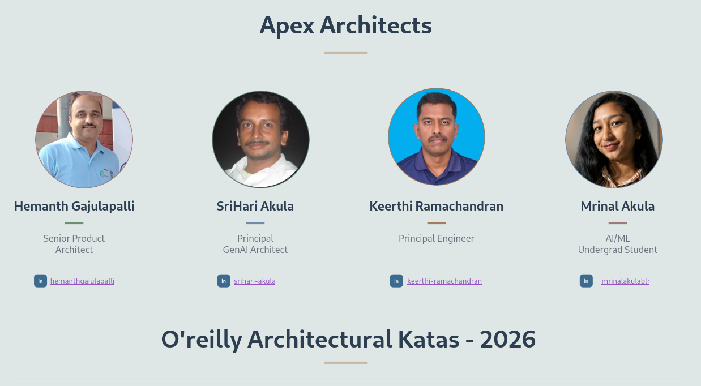
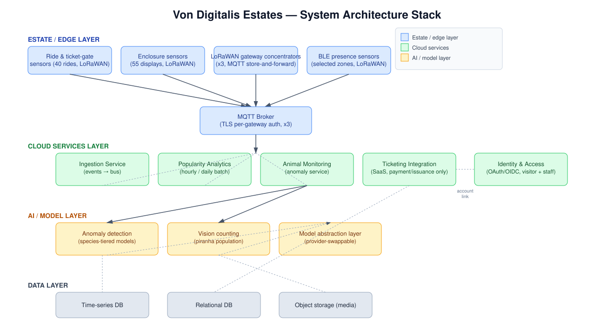

# TL;DR — Von Digitalis Estates | Team Apex Warriors

*Short form of [README.md](README.md). O'Reilly Architectural Katas 2026 — AI-Assisted Software Architecture.*

## Team
**Apex Architects**
<!-- Add team member names, roles, and links here, e.g.:
- [**Name**](https://linkedin.com/in/...), Role
-->

## The problem

A sprawling estate — 40 antique rides, 200+ animals across 55 enclosures, and the grounds — must go from **~5,000 to 15,000 visitors/day in 3 years** or the family sells off holdings. Today there's no ticketing, no idea which attractions draw crowds, no systematic animal monitoring, and **patchy WiFi** that constrains nearly every technical choice. Budget exists for MQTT-capable devices.

## The solution in one line

Cheap LoRaWAN sensors → 3 gateway concentrators → MQTT bus → event-driven cloud services → AI that **recommends, never decides**, with mandatory human confirmation on every consequential output.

## Four use cases

| | Use case | Approach | Key ADRs |
|---|---|---|---|
| **UC01** | Visitor Popularity Analytics | Ticket-gate scans as the universal signal (~95 locations, zero extra hardware) + targeted BLE in high-value zones; hourly/daily batch aggregation, no streaming; forecasting + staffing/investment recommendations behind human approval | 001, 003, 004, 021, 018 |
| **UC02** | Animal Health & Feeding | Species-tiered profiles (mammal / reptile / aquatic) instead of per-enclosure builds; two-speed inference — local thresholds work offline, cloud anomaly model runs when connectivity returns; keeper confirms or dismisses every alert, and that label retrains the model | 002, 005, 007, 011, 016 |
| **UC03** | Piranha Population Counting | Periodic keeper photo/video + vision model, **not** always-on underwater CV; declines route through UC02's confirmation flow; low-confidence counts flagged for manual verification | 006, 007 |
| **UC04** | Returning Visitor Personalization | Phase 1 (launch, no AI): simple loyalty/renewal discount. Phase 2 (deferred): grounded retrieval-based concierge, gated on one full season of real data. Identity via own OAuth/OIDC, not the ticketing vendor | 008, 016, 022 |

## Architecture characteristics

**Reliability → Availability under patchy connectivity → Cost Efficiency → Auditability → Elasticity → Adaptability.** Auditability and Adaptability are deliberately raised above the base system's bar by the AI additions.

## Testing & verification

Two tracks, tested differently, converging on one observability stack:

- **Deterministic** (ingestion, ticketing, gateways, dashboards) — conventional pyramid: unit → contract → e2e → staff UAT.
- **Non-deterministic AI** (anomaly detection, vision counting, recommendations) — "correct" is statistical: **golden-set regression as a hard CI/CD gate**, shadow/canary for high-stakes changes, continuous drift monitoring, keeper feedback capture. A failing gate blocks promotion until an explicit, attributed override.

Cross-cutting: load tested at 15,000/day (not today's volume), simulated gateway backhaul outage, LoRaWAN key / cert / RBAC security tests, DR restore drills. Ownership is explicit — engineering, keepers, ops, and security each own specific test types.

## Anti-patterns we avoided

- **Autonomous agentic AI** — every flow is ingest → infer → tier → confirm; animal welfare has too low an error tolerance for probabilistic agents.
- **Always-on underwater CV** — murky water and maintenance burden beat the "richest option" argument.
- **Building ticketing/auth from scratch** — bought or standards-based.
- **Letting the payments vendor own visitor identity** — reversed once lock-in was made explicit.
- **One WiFi gateway per zone** — ~95 connectivity points collapsed to 3.

## Known limitations

Keeper review is a throughput bottleneck *by design*; vision counting is a decision aid, not ground truth; the 3-gateway layout is a planning assumption pending an RF survey; UC04 has a deliberate cold-start delay; drift monitoring only catches the failure modes it was designed for.

## Roadmap — phased, gated by pilot validation, not the calendar

**Phase 0** Foundations (ticketing, OAuth, RF survey → LoRaWAN, observability, loyalty) → **Phase 1** Popularity analytics live → **Phase 2** Animal monitoring on 2–3 species tiers + piranha counting → **Phase 3** All 55 enclosures, evaluate the personalization trigger.

## Deeper reading

[Full README](FullREADME.md) · [ADRs](ADRs/) · [Use case designs](usecases/) · [Test approach](usecases/test-approach.md) · [Architecture characteristics](other_design_docs/architecture-characteristics.md) · [Cost analysis](other_design_docs/cost-analysis.md) · [Wireframes](wireframes/landing-page-wireframe.html) · [Glossary](business-requirements/glossary.md)
