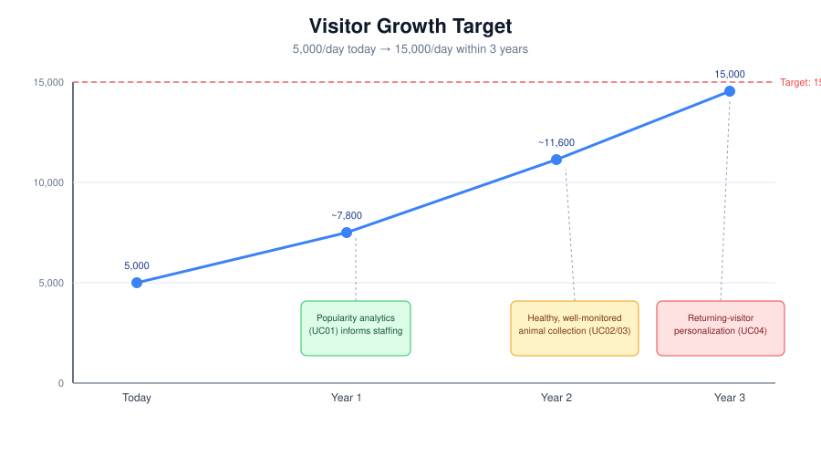
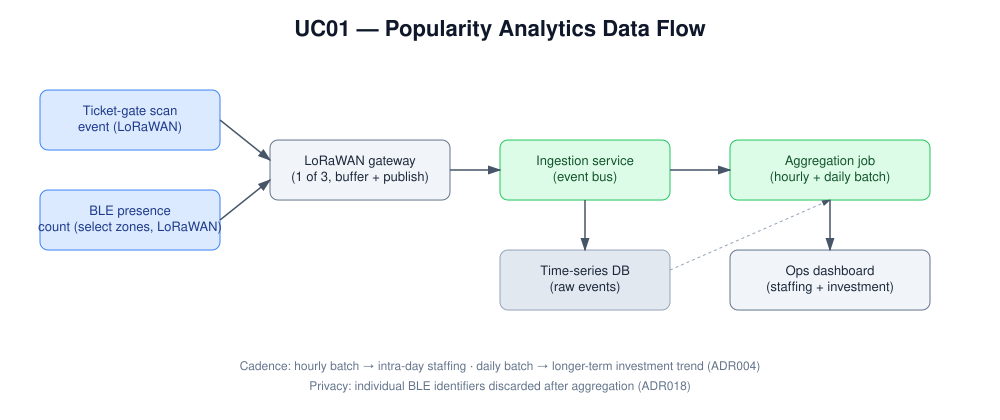
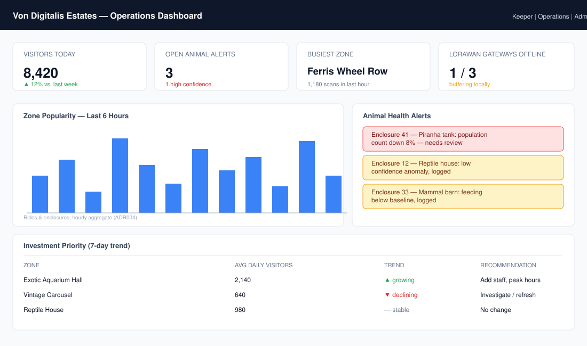
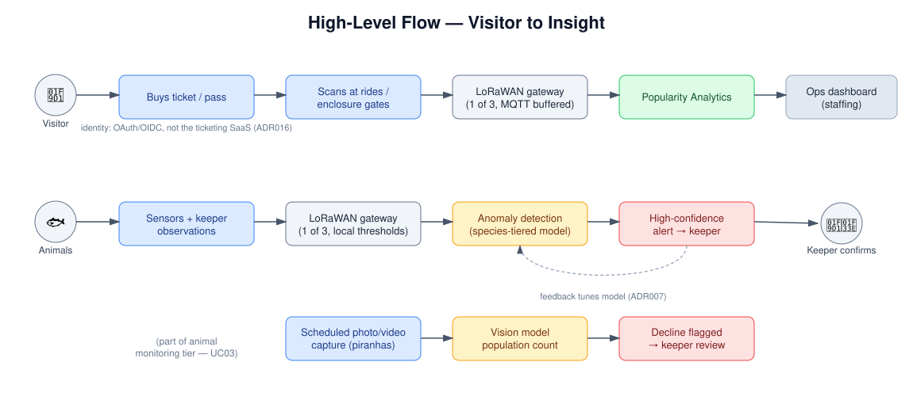

# UC01 - Visitor Popularity Analytics

## Overview

Right now the Countess has no visibility into which parts of the
estate — which of the 40 rides, which of the 55 animal enclosures —
visitors actually gravitate toward. That blind spot makes staffing and
investment decisions a matter of guesswork rather than evidence. This
use case turns everyday visitor activity (a ticket scan, a presence
detection) into a popularity signal the operations team can act on the
same day, and that leadership can use to justify longer-term
investment.

It sits at the foundation of the estate's growth story: understanding
where visitors go today is what makes it possible to improve where
they go tomorrow.

*Popularity analytics (this use case) is one of the identified drivers
behind the estate's 5,000 → 15,000 visitors/day growth target.*

## Actor(s)
- **Primary:** Operations/staffing team (day-to-day staff deployment),
  the Countess (longer-term investment decisions)
- **Secondary:** Visitors (indirect beneficiaries — better-staffed,
  better-invested attractions)

## Goal
Understand which parts of the estate are most and least popular, at a
cadence useful enough to actually change same-day staffing and
inform where future investment goes.

## Trigger
A visitor scans their ticket at a ride or enclosure entry point, or —
in the small number of zones selected for enhanced tracking — their
device is detected via anonymized BLE presence sensing.

## Preconditions
- Ticketing system (ADR009) is operational and issuing scannable
  tickets/family passes.
- MQTT gateway infrastructure (ADR001) is deployed in the relevant
  zone.
- BLE sensors are installed in the specific zones selected for
  enhanced tracking (ADR003).

## Main Flow

The diagram below shows the full path from a visitor's scan to a
number on the operations dashboard:

1. Visitor scans a ticket at a ride or enclosure entry, generating a
   scan event.
2. The event is published via the local zone gateway (ADR001) to the
   ingestion service.
3. In BLE-equipped zones, presence sensors additionally detect
   aggregate visitor counts and publish anonymized zone-level counts
   — no individual device identifier is retained past this step.
4. The Popularity Analytics service aggregates events **hourly** (for
   same-day staffing decisions) and **daily** (for longer-term
   investment/trend decisions) (ADR004).
5. Aggregated popularity data is surfaced to operations staff via a
   dashboard, showing relative attraction popularity across the
   estate.
6. Operations staff use this data to reallocate staff intra-day and to
   inform longer-term investment conversations with the Countess.

### What operations staff actually see

The aggregated data isn't useful sitting in a database — it needs to
reach a human who can act on it. The mockup below shows the kind of
view operations staff would use during a shift: which zones are
busiest right now, and which zones show a rising or declining trend
worth a longer-term look.

## AI Involvement
This use case is primarily a **data/analytics pipeline** rather than a
predictive AI feature — the "AI-assisted" element today is aggregation
and trend surfacing, not prediction. In a future phase, this same
aggregated data could feed a predictive staffing recommendation model
or the personalization feature described in UC04; if that happens, it
should be evaluated with the same golden-set/drift-monitoring rigor
applied to UC02 and UC03, not treated as free of risk just because it
builds on "just analytics."

## How This Use Case Connects to the Rest of the System

Popularity data doesn't only feed the ops dashboard — it's a visible
node in the estate's broader data flow, sitting alongside the animal
monitoring and ticketing paths:

## Alternate / Exception Flows
- **WiFi outage in a zone:** Scan/presence events are buffered locally
  at the gateway and delivered once connectivity resumes (ADR001);
  that zone's hourly aggregate may be delayed but is not lost.
- **BLE sensor unavailable or not installed:** Zone falls back to
  ticket-scan-only popularity signal — coarser (no dwell-time data)
  but still functional, since every zone has ticket-gate coverage by
  design (ADR003).
- **Family pass with multiple entries:** Each individual entry within
  a family pass is attributed correctly to its zone, so group
  purchases don't understate popularity at busy attractions.

## Related ADRs
- **ADR001** — MQTT Ingestion Architecture for Patchy WiFi
- **ADR003** — Visitor Popularity Tracking Method
- **ADR004** — Real-Time vs. Batch Analytics Pipeline
- **ADR009** — Ticketing & Family Pass Architecture
- **ADR018** — Visitor Data Privacy & Governance

## Success Metrics
- Operations staff can identify the top/bottom 5 attractions by
  popularity within an hour of a shift starting.
- Popularity data is available for 100% of zones (ticket-gate
  baseline), even where BLE coverage doesn't extend.
- No individual-level visitor location data persists beyond
  aggregation (privacy compliance, ADR018).

## See Also
- **[UC01 Test Approach](../test-approach-usecases/uc01-test-approach.md)**
  — traditional and AI-adjacent testing strategy and metrics for this
  use case.
- **[Diagrams README](../assets/README-diagrams.md)** — full
  explanation of every diagram referenced in this repo.
