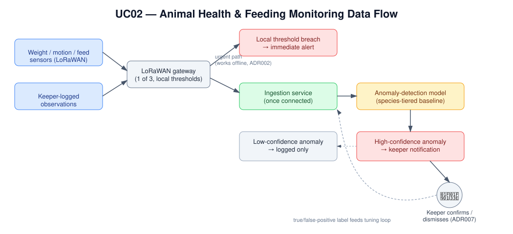
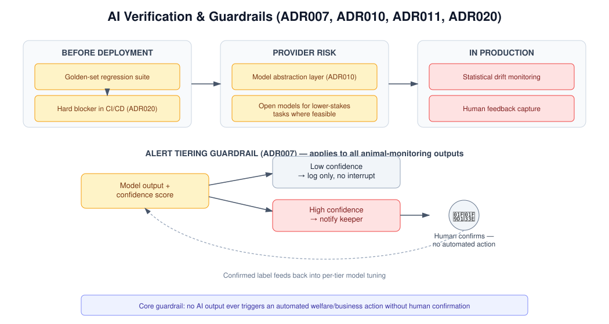

# UC02 - Animal Health & Feeding Anomaly Detection

## Overview

Animal care is one of the estate's biggest cost and reputation risks —
the brief is explicit that a sick animal is costly, and worse if it
goes unnoticed. Across 200+ animals in 55 displays and enclosures,
keepers can't watch every enclosure continuously. This use case gives
them an early-warning system: sensors and their own logged
observations feed a species-aware model that flags when something
looks off, so a keeper can intervene before a minor issue becomes a
serious one.

The design deliberately keeps a human in charge of every consequential
decision — the model's job is to notice something worth a second look,
not to decide what to do about it.

## Actor(s)
- **Primary:** Keeper / animal welfare staff
- **Secondary:** The Countess (cost and reputation exposure of sick or
  poorly cared-for animals)

## Goal
Detect early signs of ill health or feeding problems across the
collection, at a false-positive rate keepers can actually live with,
so real issues get caught without staff learning to ignore the alerts.

## Trigger
A sensor reading (weight, motion/activity, feeding-station trigger) or
a keeper-logged observation falls outside the expected baseline for
that enclosure's species tier.

## Preconditions
- The enclosure is assigned to a species-tier monitoring profile
  (mammal, reptile/land, aquatic) with an established baseline
  (ADR005).
- The zone gateway and sensors are installed and reporting (ADR001).
- The keeper logging workflow (feeding amounts, behavior notes) is in
  active use.

## Main Flow

The data flow below shows the two speeds this feature runs at: an
"urgent path" that works even when the zone's WiFi is down, and a
"standard path" where the richer cloud model does the deeper analysis.

1. Sensors continuously report activity, weight, and feeding-station
   data to the local zone gateway.
2. The gateway applies simple local thresholds for the most urgent
   conditions (e.g. no motion detected in N hours) and can raise an
   immediate local alert even if the zone is offline (ADR002).
3. All raw data is also forwarded to the cloud (once connectivity
   allows), where the tier-specific anomaly-detection model analyzes
   trends against the enclosure's baseline.
4. Keeper-logged observations (feeding amount, behavior notes) feed
   into the same model as an additional signal.
5. A high-confidence anomaly notifies keeper staff; a low-confidence
   one is logged only, to avoid unnecessary interruptions (ADR007).
6. A keeper reviews the flagged alert, confirms or dismisses it, and
   takes appropriate action (e.g. schedules a vet check).
7. The keeper's true/false-positive label feeds back into the model
   tuning loop (ADR007) — the system gets better at telling real
   issues from noise over time.

### How the "human in the loop" guardrail works

Every alert this feature raises passes through the same tiering and
confirmation guardrail — no output ever triggers an automated welfare
action on its own.

### Where this shows up for staff

Flagged alerts land directly in the same operations dashboard used for
popularity data — keepers don't need a separate tool to see what needs
attention.

## AI Involvement
Tier-specific anomaly-detection models (cloud-side) analyze sensor and
keeper-logged data against a learned baseline per species tier;
lightweight local threshold rules (not full ML) cover the most urgent,
connectivity-independent cases. This is the solution's most
AI-dependent use case, and the one with the most explicit verification
tooling wrapped around it (see ADR011 and the guardrails diagram
above).

## Alternate / Exception Flows
- **Zone offline:** Local threshold alerting still functions (ADR002);
  richer cloud-based anomaly analysis resumes once connectivity is
  restored and buffered data is delivered.
- **Alert falsely flagged:** Keeper marks it as a false positive; this
  feedback retunes thresholds/model over time (ADR007), reducing
  future alert fatigue.
- **New or unusual species not fitting an existing tier:** Handled as
  a manual exception, monitored primarily via keeper logging until
  enough data exists to fit or create a tier.

## Related ADRs
- **ADR001** — MQTT Ingestion Architecture for Patchy WiFi
- **ADR002** — Edge vs. Cloud Inference Strategy
- **ADR005** — Animal Health & Feeding Monitoring Approach
- **ADR007** — Alert Validation & False-Positive Tolerance
- **ADR011** — Verification of Non-Deterministic AI Outputs

## Success Metrics
- Time from an anomaly's onset to a keeper being notified is
  minimized, including during WiFi outages (via local thresholds).
- False-positive rate stays within the tolerance keepers defined
  before launch (ADR007), avoiding alert fatigue.
- No confirmed health issue goes undetected for more than one keeper
  check-in cycle.

## See Also
- **[UC02 Test Approach](../test-approach-usecases/uc02-test-approach.md)**
  — traditional and AI testing strategy, including precision/recall,
  keeper-agreement, and drift metrics for this use case.
- **[Diagrams README](../assets/README-diagrams.md)** — full
  explanation of every diagram referenced in this repo.
