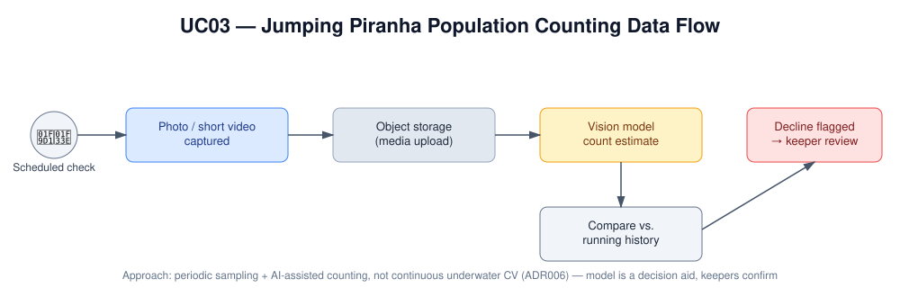

# UC03 - Jumping Piranha Population Counting

## Overview

The brief calls out one very specific requirement: check population
levels in the jumping piranha collection. Counting fish in water is
genuinely harder than most animal monitoring — poor visibility,
occlusion, and constant movement make simple sensors unreliable. Rather
than trying to build always-on underwater monitoring for a single
enclosure, this use case takes a lighter-touch approach: a keeper
captures a photo or short video during routine checks, and a vision
model assists by counting what it can see, flagging anything that
looks like a meaningful decline for a keeper to verify.

## Actor(s)
- **Primary:** Keeper / animal welfare staff (aquatic tier)
- **Secondary:** The Countess (visitor safety and attraction viability)

## Goal
Track the jumping piranha population over time so keepers can detect
and respond to a meaningful decline (or unexpected growth) before it
becomes a welfare or safety issue — without the cost and maintenance
burden of continuous underwater monitoring.

## Trigger
A scheduled keeper check (e.g. weekly, or alongside routine feeding)
where photo or short video of the enclosure is captured.

## Preconditions
- The piranha enclosure is assigned to the aquatic monitoring tier
  (ADR005).
- A capture workflow (camera or keeper's device) is in place for
  routine sampling.
- A running history of prior counts exists to compare against.

## Main Flow

The diagram below traces the full path from a routine check to a
flagged decline:

1. During a scheduled check, a keeper captures a photo or short video
   of the enclosure.
2. The media is uploaded (via the zone gateway or directly, depending
   on connectivity) to object storage (ADR014).
3. A vision model processes the captured media and estimates the
   visible population count.
4. The estimated count is compared against the running historical
   count for that enclosure.
5. If the count shows a meaningful decline (or unexpected change), an
   alert is raised to keeper staff for review, using the same
   tiered-alert/confirmation flow as UC02 (ADR007).
6. A keeper reviews the flagged change, optionally cross-checking with
   a manual count, and decides on any follow-up action.
7. Feeding-consumption data (captured as part of UC02) is available as
   a secondary, corroborating signal alongside the direct count.

### Why counting is treated as a decision aid, not an oracle

Underwater conditions make any single count imperfect. The same
verification approach used for animal-health alerts applies here —
low-confidence counts are surfaced for manual review rather than
auto-reported as fact, and the model's accuracy is validated against
keeper manual counts before it's trusted unsupervised.

## AI Involvement
A computer-vision model assists keepers by counting individuals
visible in periodically captured photo/video, rather than performing
continuous autonomous monitoring — the model is a decision aid, not a
fully automated headcount.

## Alternate / Exception Flows
- **Poor image quality (water clarity, glare, occlusion):** The vision
  model flags low-confidence counts for manual keeper verification
  rather than auto-reporting an uncertain number.
- **Capture missed for a cycle:** No count is generated for that
  period; the next scheduled capture picks up the history — an
  accepted trade-off of the periodic-sampling approach (ADR006).

## Related ADRs
- **ADR005** — Animal Health & Feeding Monitoring Approach
- **ADR006** — Jumping Piranha Population Counting
- **ADR007** — Alert Validation & False-Positive Tolerance
- **ADR011** — Verification of Non-Deterministic AI Outputs
- **ADR014** — Data Storage Strategy

## Success Metrics
- Vision-model count accuracy validated against keeper manual counts
  within an agreed tolerance before being trusted unsupervised.
- A meaningful population decline is detected within one sampling
  cycle of it occurring.
- Keepers retain final judgment on any population-related welfare
  action — no automated response is triggered directly from a count.

## See Also
- **[UC03 Test Approach](../test-approach-usecases/uc03-test-approach.md)**
  — traditional and AI testing strategy, including MAE/MAPE and
  false/missed-decline metrics for this use case.
- **[Diagrams README](../assets/README-diagrams.md)** — full
  explanation of every diagram referenced in this repo.
