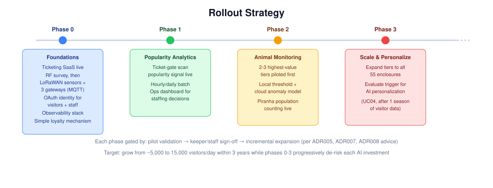

# UC04 - AI-Assisted Returning Visitor Personalization (Future Phase)

## Overview

Growing visitor numbers isn't only about attracting new visitors — the
Countess also wants more people coming back. But at launch, there's no
visitor history to personalize anything against, so building an AI
recommendation feature on day one would mean personalizing against
nothing. This use case is deliberately staged: a simple, non-AI loyalty
mechanism ships first, and an AI-driven personalization feature is
held back until there's enough real ticketing and popularity data to
make it worth building.

## Actor(s)
- **Primary:** Repeat / prospective returning visitors
- **Secondary:** The Countess and marketing/operations (owners of the
  growth goal)

## Goal
Increase the estate's returning-visitor rate — first through a simple
mechanism live at launch, and later through tailored recommendations
once visitor history exists to make personalization meaningful rather
than generic.

## Trigger
A visitor with an existing ticketing/loyalty account returns to the
estate's booking channel, or (once Phase Two is live) opts into an
in-park AI concierge experience.

## Preconditions
- At least one full operating season of ticketing (ADR009) and
  popularity data (UC01) has been collected, before Phase Two begins.
- The estate has evaluated and greenlit the Phase Two investment
  (ADR008 explicitly defers this until data justifies it).
- A visitor identity/loyalty mechanism exists to associate return
  visits with prior history.

## Main Flow — Phase One (Live at Launch, Non-AI)
1. A visitor purchases a ticket/family pass and is enrolled in a
   simple loyalty mechanism (e.g. discounted renewal, digital loyalty
   card) (ADR008).
2. On a return visit, the loyalty mechanism is applied automatically
   at checkout — no personalization logic involved yet.

## Main Flow — Phase Two (Future, AI-Assisted)
1. Once sufficient ticketing/popularity history exists, a
   recommendation model analyzes a visitor's prior visit pattern
   (attractions visited, popularity trends per UC01) against the
   current state of the estate.
2. The visitor is offered a personalized itinerary suggestion or a
   targeted return offer (e.g. highlighting under-visited attractions,
   a discount timed to a quiet period).
3. Visitor engagement with the recommendation is captured as feedback,
   feeding into ongoing model refinement (per the verification
   approach in ADR011).

### Why this data dependency matters

Phase Two only makes sense once the popularity-analytics pipeline
(UC01) has been running long enough to have real patterns to learn
from — which is exactly the same data this use case's growth
contribution is charted against below.

## AI Involvement
Phase One has no AI involvement — a straightforward loyalty mechanism.
Phase Two, once triggered, introduces a recommendation model that uses
the estate's own popularity analytics (UC01) and visitor history as
input. This is explicitly scoped as a future investment, not part of
the initial build, and — like every other AI feature in this
solution — would go through golden-set evaluation and drift monitoring
before being trusted at scale (ADR011).

## Alternate / Exception Flows
- **Insufficient data at evaluation point:** Phase Two is delayed
  further rather than launched with unreliable or generic
  recommendations (ADR008).
- **Visitor opts out of personalization:** Falls back to Phase One
  loyalty mechanism only, per standard privacy/consent handling
  (ADR018).

## Related ADRs
- **ADR003** — Visitor Popularity Tracking Method
- **ADR008** — Returning Visitor Growth Mechanism
- **ADR009** — Ticketing & Family Pass Architecture
- **ADR010** — Model & Provider Portability Strategy
- **ADR018** — Visitor Data Privacy & Governance

## Success Metrics
- **Phase One:** measurable uptake of the loyalty mechanism among
  repeat visitors within the first season.
- **Phase Two trigger:** a defined, agreed threshold of ticketing/
  popularity data volume is reached before development begins.
- **Once live (Phase Two):** improvement in returning-visitor rate
  attributable to personalized recommendations, measured against the
  Phase One baseline.

## See Also
- **[UC04 Test Approach](../test-approach-usecases/uc04-test-approach.md)**
  — testing strategy for both phases, including offline
  precision@k/recall@k and click-through metrics for the future AI
  phase.
- **[Diagrams README](../assets/README-diagrams.md)** — full
  explanation of every diagram referenced in this repo.
